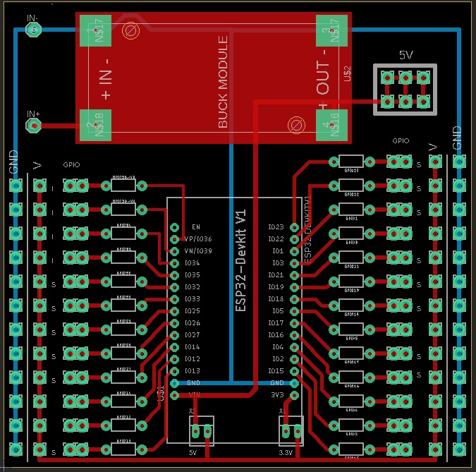
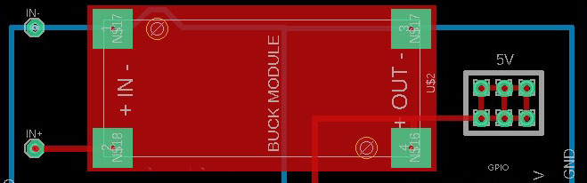
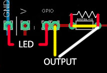
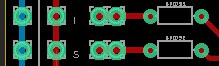

# esp32 Kraken
A funny name for a simple pcb for a esp32 prototipe, designed to use all i/o as input and output with different configurations

This board is deisgned to imporve the quality of development forgetting the protobard with folating wires and no-contact noise.

The pcb is designed by eagle

The size of the board is 100x100mm perfect to pass as prototype in jlcpb and get it at a low price (around 22$ for 5 boards).

Currently the pcb is designed to fit with esp32 dev kit with 30pins

The pcb.zip file contain the geber file to upload in your favourite pcb manufacturing site ♥️

  

## How does it work?

Very well! 🙂 with this configuration you don't have limit, all I/O are ready to use in all the way you can think let's take a look:

### Power supply

If you want you can add a LM2596 DC-DC step down, otherwise you can give 5V directly on OUT+ and OUT-

  

In the right side there's some 5V spare pins where you can pluc i2c devices or what you want

### V voltage selector
As you can see there's a GND and a V pin for each input, you can choose the V voltage as you prefer in 5V or 3.3V bridgin one of the the selector in the buttom, or give your own voltage to the V line (this will help cause 3.3V are providev from internal esp32 voltage regulator

  

### Input

Free to choose in wich way you wanna use it, in the past I hade some problem using internal pull up/pull down resistor and this is why I build this board in a first step.

You can provide olso 5V signal to the esp32 adding a zener diode, or a fancy 10K resistor but after don't cry if your esp32 blow up 🤯 furthermore the ground of all two system shuold be connected between

#### External Pull Up/Down Resistor

Pull down:

  

Pull Up

  

#### Directly input

You can give olso direct input of coure in two way, the white one, is more boring, you need a bridge but can be useful if you neet to measure the volatage, for the listless there's olso the red one solution

  

#### Others funny thing you can do

You can use a zener with resistor for limit the voltage, you can use a capacitor with a resistor for having an external debounce system, but be careful adding a lot of thing or your board become a christmas tree 🎄

### Output

Output can be use in three differt way, directly like the input with the same method, you can usa a bridge to measuere the voltage (yellow way) or plug the wire directly before gpio resistance (white way) , if you wanna plug a led you can simply add a resistor in the appropriate space (red way)

  

### Board notes

If you are not myopic you can see an I or an S near some GPIO, what they mean???

I stand for Only-Input GPIO

S stand for "Safety" that is you can use that output without going to have problems like pwm at the boot

  

## Hope you like it!
